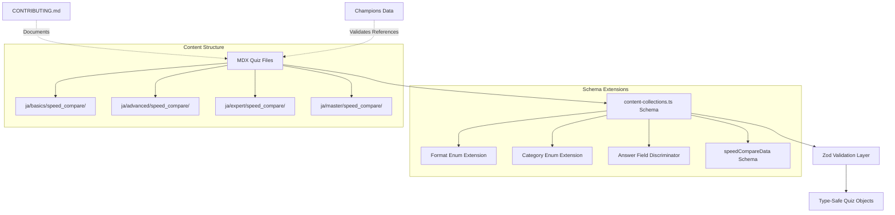

# Design Document: Quiz Format Expansion

## Overview

This design implements support for four new quiz formats (`multi_select`, `ordering`, `grouping`, `one_way`) and a new quiz category (`speed_compare`) in the Pokemetrix quiz system. The changes span schema validation, documentation updates, and content creation for 40 new speed comparison questions across all difficulty levels.

The feature enables content creators to author varied question types beyond simple multiple choice, particularly for Expert and Master difficulty levels, and introduces a dedicated practical quiz track for speed calculation—a core skill in VGC double battles.

### Goals

1. Extend `content-collections.ts` schema to validate 5 total formats (existing `choices` + 4 new formats)
2. Add `speed_compare` as a fourth quiz category alongside `academic`, `damage_calc`, and `tsume`
3. Implement format-specific answer field validation (`correctAnswers`, `correctOrder`, `correctGroups`)
4. Enforce difficulty–format constraints at schema level (Basics/Advanced = `choices` only; Expert adds `multi_select`/`ordering`; Master adds `grouping`/`one_way`)
5. Update CONTRIBUTING.md sections 0–3 to document new formats, category, and difficulty constraints
6. Create 40 new `speed_compare` quiz files (10 per difficulty) with appropriate format restrictions

### Non-Goals

- UI implementation for rendering new formats (out of scope for this spec)
- Migration of existing `choices` quizzes to new formats
- Auto-generation of speed comparison questions from Champions data
- Localization of new quiz content to English (initial creation in Japanese only)

## Architecture

### Component Overview



### Data Flow

1. **Content Creation**: Authors write MDX files with frontmatter conforming to updated schema
2. **Build-Time Validation**: `content-collections` runs Zod schema validation during build
3. **Type Generation**: Validated data becomes type-safe TypeScript objects
4. **Runtime Usage**: Quiz UI components consume typed quiz objects


## Components and Interfaces

### 1. Schema Changes: `content-collections.ts`

#### 1.1 Format Enum Extension

**Current State:**
```typescript
format: z.enum(["choices", "input"])
```

**New State:**
```typescript
format: z.enum(["choices", "multi_select", "ordering", "grouping", "one_way", "input"])
```

#### 1.2 Category Enum Extension

**Current State:**
```typescript
category: z.enum(["academic", "damage_calc", "tsume"])
```

**New State:**
```typescript
category: z.enum(["academic", "damage_calc", "tsume", "speed_compare"])
```

#### 1.3 Answer Field Discriminated Union

The schema currently uses a single `correctAnswer: z.string()` field. We need to add format-specific answer fields while maintaining backward compatibility.

**Implementation Strategy:**
```typescript
// Base schema with conditional answer fields
schema: z.object({
  // ... existing fields
  format: z.enum(["choices", "multi_select", "ordering", "grouping", "one_way", "input"]),
  
  // Make correctAnswer optional (used by choices, one_way, input)
  correctAnswer: z.string().optional(),
  
  // Add new format-specific answer fields (all optional)
  correctAnswers: z.array(z.string()).optional(),   // for multi_select
  correctOrder: z.array(z.string()).optional(),     // for ordering
  correctGroups: z.record(z.string(), z.array(z.string())).optional(), // for grouping
})
.refine((data) => {
  // Validation: ensure correct answer field is present for each format
  if (data.format === "multi_select") {
    return data.correctAnswers !== undefined && data.correctAnswers.length > 0;
  }
  if (data.format === "ordering") {
    return data.correctOrder !== undefined && data.correctOrder.length === 4;
  }
  if (data.format === "grouping") {
    return data.correctGroups !== undefined && Object.keys(data.correctGroups).length >= 2;
  }
  if (["choices", "one_way", "input"].includes(data.format)) {
    return data.correctAnswer !== undefined && data.correctAnswer.length > 0;
  }
  return false;
}, {
  message: "Answer field must match format type"
})
```


#### 1.4 Options Validation by Format

Each format has specific constraints on the `options` array:

```typescript
.refine((data) => {
  // Validation: options array constraints per format
  if (!data.options) {
    return data.format === "input"; // only input format can omit options
  }
  
  const optionsCount = data.options.length;
  
  switch (data.format) {
    case "multi_select":
      return optionsCount >= 3 && optionsCount <= 4;
    case "ordering":
      return optionsCount === 4;
    case "grouping":
      return optionsCount >= 3 && optionsCount <= 5;
    case "one_way":
      return optionsCount >= 2 && optionsCount <= 6;
    case "choices":
      return optionsCount >= 2 && optionsCount <= 4;
    case "input":
      return true; // input format doesn't require options
    default:
      return false;
  }
}, {
  message: "Options count must match format requirements"
})
```

#### 1.5 Difficulty–Format Constraint Validation

Per CONTRIBUTING.md section 0, format availability is gated by difficulty:

```typescript
.refine((data) => {
  const { difficulty, format } = data;
  
  // Basics and Advanced: only "choices" allowed
  if (["basics", "advanced"].includes(difficulty)) {
    return format === "choices";
  }
  
  // Expert: choices, multi_select, ordering allowed
  if (difficulty === "expert") {
    return ["choices", "multi_select", "ordering"].includes(format);
  }
  
  // Master: all formats allowed
  if (difficulty === "master") {
    return ["choices", "multi_select", "ordering", "grouping", "one_way"].includes(format);
  }
  
  return false;
}, {
  message: "Format not allowed for this difficulty level"
})
```


#### 1.6 speedCompareData Schema

For `speed_compare` category quizzes, an optional structured data field provides context for speed calculations:

```typescript
const speedCompareDataSchema = z.object({
  pokemonA: z.string(), // identifier from Champions pokemon.json
  pokemonB: z.string(), // identifier from Champions pokemon.json
  context: z.string(),  // Human-readable description: "A has S32+ with こだわりスカーフ, B has S32 neutral"
});

// In main quiz schema:
schema: z.object({
  // ... other fields
  speedCompareData: speedCompareDataSchema.optional(),
})
```

**Design Rationale:**
- `speedCompareData` is **optional** because simple ○× questions about base stats may not need structured data
- The `context` field stores EV/nature/item conditions in human-readable format rather than structured fields
- This allows flexibility for complex scenarios (おいかぜ, トリックルーム, status conditions) without rigid schema constraints

#### 1.7 Complete Updated Schema

```typescript
const speedCompareDataSchema = z.object({
  pokemonA: z.string(),
  pokemonB: z.string(),
  context: z.string(),
});

const quizzes = defineCollection({
  name: "quizzes",
  directory: "content/quiz",
  include: "**/*.mdx",
  schema: z.object({
    id: z.string(),
    difficulty: z.enum(["basics", "advanced", "expert", "master"]),
    category: z.enum(["academic", "damage_calc", "tsume", "speed_compare"]),
    format: z.enum(["choices", "multi_select", "ordering", "grouping", "one_way", "input"]),
    question: z.string(),
    options: z.array(z.string()).optional(),
    
    // Answer fields (format-dependent)
    correctAnswer: z.string().optional(),
    correctAnswers: z.array(z.string()).optional(),
    correctOrder: z.array(z.string()).optional(),
    correctGroups: z.record(z.string(), z.array(z.string())).optional(),
    
    prerequisites: z.array(z.string()).default([]),
    
    // Category-specific data
    practicalData: practicalDataSchema.optional(),
    tsumeData: tsumeDataSchema.optional(),
    speedCompareData: speedCompareDataSchema.optional(),
    
    content: z.string(),
  })
  .refine(/* answer field validation */)
  .refine(/* options count validation */)
  .refine(/* difficulty-format constraint */),
  transform: transformer({ withHeadings: false }),
});
```


### 2. CONTRIBUTING.md Updates

#### 2.1 Section 0: Category, Format, and Difficulty Settings

**Addition to カテゴリ subsection:**
```markdown
- **学科 (Academic)**: 純粋な知識のみを問うカテゴリ
- **実技 (Practical)**: ダメージ計算/素早さ計算/詰めポケ の3種類
```

**Addition to 出題形式 subsection:**
```markdown
- **○×クイズ**: 命題が真か偽かを答える問題
- **4択クイズ**: 4つの中から1つの正解を答える問題
- **一問多答**: 問題に対して、示された3つまたは4つの選択肢の中から正しいものを過不足なくすべて選択する問題
- **順番当て**: 4つの選択肢を、問題文で示された順番に選択する問題
- **グループ分け**: 3~5つの選択肢を2つまたは3つのグループに分けて解答する問題
- **一方通行**: まず1番の選択肢が表示され、2番以降の選択肢は伏せられている。正解だと思ったら、その選択肢を押し、違うと思ったら、選択肢横の「次」をタッチして次の選択肢を開ける形式。
```
*(Note: These already exist in CONTRIBUTING.md, no changes needed)*

**Update to 難易度設定 subsection (Practical bullet points):**
```markdown
- **Practical**:
  - **Speed Compare**: 提示されたポケモンAに対してポケモンBが素早さ種族値を上回っているかの○×クイズ
  - **Damage Calc**: タイプ相性や道具をの効果など基礎知識を問う
  - **Tsume**: 先制技や全体技を使った基礎的な盤面を扱う（ヘッズアップのみ）
```
*(Repeat similar updates for Advanced, Expert, Master)*

#### 2.2 Section 1: File Placement

**Update the category list:**
```markdown
- **`[category]`**: `academic`, `damage_calc`, `tsume`, `speed_compare` のいずれか
```

#### 2.3 Section 2: Frontmatter Property Table

**Add new enum values to `format` row:**
```markdown
| **`format`**        | `enum`     |  ✅  | 回答形式。`choices` (選択式), `multi_select` (一問多答), `ordering` (順番当て), `grouping` (グループ分け), `one_way` (一方通行), `input` (入力式) のいずれか。 |
```

**Add new answer field rows:**
```markdown
| **`correctAnswers`** | `string[]` |  ⚠️  | 正解の配列（`format: "multi_select"` の場合は必須）。すべての正解を含む必要があります。 |
| **`correctOrder`**   | `string[]` |  ⚠️  | 正しい順序の配列（`format: "ordering"` の場合は必須）。必ず4つの選択肢を順番通りに含む必要があります。 |
| **`correctGroups`**  | `Record<string, string[]>` |  ⚠️  | グループラベルをキーとし、各グループのメンバー配列を値とするオブジェクト（`format: "grouping"` の場合は必須）。 |
```


#### 2.4 Section 3: Category-Specific Special Data

**Add new subsection after `tsumeData`:**

```markdown
### `speed_compare` の場合 (`speedCompareData`)
素早さ比較の状況を定義するために `speedCompareData` を追加します（オプション）。

\```yaml
speedCompareData: {
  "pokemonA": "garchomp",
  "pokemonB": "salamence", 
  "context": "ガブリアスは S32+ こだわりスカーフ、ボーマンダは S32 いじっぱり"
}
\```

**プロパティ詳細:**
- `pokemonA`: ポケモンAの識別子（`pokemon.json` の `identifier` フィールドと一致）
- `pokemonB`: ポケモンBの識別子
- `context`: 努力値・性格・持ち物・場の状態などの説明文

**注意:** 基本的な種族値比較のみを問う○×クイズの場合、`speedCompareData` は省略可能です。
```

## Data Models

### Quiz Frontmatter Type (Generated)

```typescript
type QuizFormat = "choices" | "multi_select" | "ordering" | "grouping" | "one_way" | "input";
type QuizCategory = "academic" | "damage_calc" | "tsume" | "speed_compare";
type QuizDifficulty = "basics" | "advanced" | "expert" | "master";

interface SpeedCompareData {
  pokemonA: string;
  pokemonB: string;
  context: string;
}

interface Quiz {
  id: string;
  difficulty: QuizDifficulty;
  category: QuizCategory;
  format: QuizFormat;
  question: string;
  options?: string[];
  
  // Answer fields (format-dependent)
  correctAnswer?: string;           // for: choices, one_way, input
  correctAnswers?: string[];        // for: multi_select
  correctOrder?: string[];          // for: ordering
  correctGroups?: Record<string, string[]>; // for: grouping
  
  prerequisites: string[];
  practicalData?: PracticalData;
  tsumeData?: TsumeData;
  speedCompareData?: SpeedCompareData;
  
  content: string;
  slug: string;
  locale: "ja" | "en";
  mdx: MDXContent;
}
```


### Directory Structure for speed_compare

```
apps/web/content/quiz/
├── ja/
│   ├── basics/
│   │   ├── academic/
│   │   ├── damage_calc/
│   │   ├── tsume/
│   │   └── speed_compare/        # NEW: 10 files
│   │       ├── speed_basics_01.mdx
│   │       ├── speed_basics_02.mdx
│   │       └── ...
│   ├── advanced/
│   │   ├── academic/
│   │   ├── damage_calc/
│   │   ├── tsume/
│   │   └── speed_compare/        # NEW: 10 files
│   │       ├── speed_advanced_01.mdx
│   │       └── ...
│   ├── expert/
│   │   ├── academic/
│   │   ├── damage_calc/
│   │   ├── tsume/
│   │   └── speed_compare/        # NEW: 10 files
│   │       ├── speed_expert_01.mdx
│   │       └── ...
│   └── master/
│       ├── academic/
│       ├── damage_calc/
│       ├── tsume/
│       └── speed_compare/        # NEW: 10 files
│           ├── speed_master_01.mdx
│           └── ...
└── en/
    └── (same structure, initially empty for speed_compare)
```

### Example Quiz Files

#### Basics Example (○× format)
```yaml
---
id: speed_basics_01
difficulty: basics
category: speed_compare
format: choices
question: "ガブリアスの素早さ種族値は、ボーマンダの素早さ種族値より高いか？"
options:
  - "○"
  - "×"
correctAnswer: "○"
speedCompareData:
  {
    "pokemonA": "garchomp",
    "pokemonB": "salamence",
    "context": "種族値のみ比較"
  }
---

ガブリアスの素早さ種族値は102、ボーマンダは100なのでガブリアスの方が速いです。
```

#### Advanced Example (EV consideration)
```yaml
---
id: speed_advanced_03
difficulty: advanced
category: speed_compare
format: choices
question: "S32+ ようきガブリアスと S32 ようきサザンドラでは、どちらが速いか？"
options:
  - "ガブリアス"
  - "サザンドラ"
  - "同速"
correctAnswer: "ガブリアス"
---

ガブリアス: (102 × 2 + 32) × 1.1 = 259
サザンドラ: (98 × 2 + 32) × 1.1 = 251
ガブリアスの方が速いです。
```


#### Expert Example (Item + Field condition, multi_select format)
```yaml
---
id: speed_expert_05
difficulty: expert
category: speed_compare
format: multi_select
question: "おいかぜ中、以下のポケモンのうちS32 ようきガブリアスより速いものをすべて選べ。"
options:
  - "S32 ひかえめトゲキッス"
  - "S32+ ようきルカリオ"
  - "S0 れいせいクレセリア こだわりスカーフ"
correctAnswers:
  - "S32+ ようきルカリオ"
  - "S0 れいせいクレセリア こだわりスカーフ"
---

おいかぜ中は素早さが2倍になります。
- ガブリアス: 259 × 2 = 518
- トゲキッス: (80 × 2 + 32) × 0.9 = 172 → 344（おいかぜ）< 518
- ルカリオ: (112 × 2 + 32) × 1.1 = 282 → 564（おいかぜ）> 518
- クレセリア: (85 × 2) × 0.9 = 153 → 153 × 1.5 = 229.5（スカーフ）→ 459（おいかぜ+スカーフ）< 518

※クレセリアのスカーフ補正はおいかぜ前に適用され、さらにおいかぜで2倍されます。
```

#### Master Example (ordering format)
```yaml
---
id: speed_master_02
difficulty: master
category: speed_compare
format: ordering
question: "トリックルーム下で以下の4匹を遅い順に並べよ（同速はランダムとする）。"
options:
  - "S32+ いじっぱりバンギラス"
  - "S0 れいせいポリゴン2"
  - "S0 ゆうかんカビゴン こだわりスカーフ"
  - "S6 ゆうかんナットレイ"
correctOrder:
  - "S0 ゆうかんカビゴン こだわりスカーフ"
  - "S0 れいせいポリゴン2"
  - "S6 ゆうかんナットレイ"
  - "S32+ いじっぱりバンギラス"
---

トリックルーム下では素早さが低いポケモンから行動します。ただし、こだわりスカーフは素早さ実数値を1.5倍するため、S0でも他のS0より速くなります。

計算:
- バンギラス: (61 × 2 + 32) × 1.1 = 170
- ポリゴン2: (60 × 2) = 120
- カビゴン: (30 × 2) × 1.5 = 90（スカーフ補正後）
- ナットレイ: (20 × 2 + 6) = 46

トリルでは実数値が低い方が速いので、カビゴン(90) > ポリゴン2(120) > ナットレイ(46) の順になります。
※あれ、ナットレイが最も遅い...？実は、スカーフ持ちは常に素早さ実数値×1.5なので、トリル下でも逆順です。

正しい順序: カビゴン(90) → ポリゴン2(120) → ナットレイ(46) → バンギラス(170)
（トリル下で遅い = 実数値が低い から速い）
```


## Testing Strategy

### PBT Applicability Assessment

This feature involves **schema validation and configuration** rather than algorithmic logic with a wide input space. The core changes are:
- Enum extensions (adding new valid values to existing enums)
- Conditional validation rules (format-dependent answer fields, difficulty-format constraints)
- Static content creation (40 quiz MDX files)

**Property-based testing is NOT appropriate** for this feature because:
1. The schema validation is declarative Zod configuration, not algorithmic logic
2. The input space is finite and discrete (5 formats × 4 difficulties × 4 categories)
3. We are testing configuration correctness, not mathematical properties or data transformations
4. Full coverage can be achieved with targeted example-based tests

**Testing Strategy:** Unit tests with example-based validation + integration tests

### Unit Testing Approach

#### Test Suite 1: Format Enum Validation
**Goal:** Verify all 5 formats are accepted and invalid formats are rejected

```typescript
describe("Quiz Schema - Format Validation", () => {
  it("accepts all valid formats", () => {
    const validFormats = ["choices", "multi_select", "ordering", "grouping", "one_way", "input"];
    validFormats.forEach(format => {
      expect(() => quizSchema.parse({ ...baseQuiz, format })).not.toThrow();
    });
  });
  
  it("rejects invalid formats", () => {
    expect(() => quizSchema.parse({ ...baseQuiz, format: "invalid" })).toThrow();
  });
});
```

#### Test Suite 2: Category Enum Validation
**Goal:** Verify speed_compare is accepted alongside existing categories

```typescript
describe("Quiz Schema - Category Validation", () => {
  it("accepts speed_compare category", () => {
    expect(() => quizSchema.parse({ 
      ...baseQuiz, 
      category: "speed_compare" 
    })).not.toThrow();
  });
  
  it("accepts all valid categories", () => {
    const validCategories = ["academic", "damage_calc", "tsume", "speed_compare"];
    validCategories.forEach(category => {
      expect(() => quizSchema.parse({ ...baseQuiz, category })).not.toThrow();
    });
  });
});
```


#### Test Suite 3: Answer Field Validation
**Goal:** Ensure correct answer field is required for each format

```typescript
describe("Quiz Schema - Answer Field Validation", () => {
  it("requires correctAnswer for choices format", () => {
    const quiz = { ...baseQuiz, format: "choices", options: ["A", "B"] };
    expect(() => quizSchema.parse(quiz)).toThrow(); // missing correctAnswer
    expect(() => quizSchema.parse({ ...quiz, correctAnswer: "A" })).not.toThrow();
  });
  
  it("requires correctAnswers array for multi_select format", () => {
    const quiz = { ...baseQuiz, format: "multi_select", options: ["A", "B", "C"] };
    expect(() => quizSchema.parse(quiz)).toThrow();
    expect(() => quizSchema.parse({ ...quiz, correctAnswers: ["A", "B"] })).not.toThrow();
  });
  
  it("requires correctOrder array for ordering format", () => {
    const quiz = { ...baseQuiz, format: "ordering", options: ["A", "B", "C", "D"] };
    expect(() => quizSchema.parse(quiz)).toThrow();
    expect(() => quizSchema.parse({ ...quiz, correctOrder: ["A", "B", "C", "D"] })).not.toThrow();
  });
  
  it("requires correctGroups object for grouping format", () => {
    const quiz = { ...baseQuiz, format: "grouping", options: ["A", "B", "C"] };
    expect(() => quizSchema.parse(quiz)).toThrow();
    expect(() => quizSchema.parse({ 
      ...quiz, 
      correctGroups: { "Group1": ["A", "B"], "Group2": ["C"] } 
    })).not.toThrow();
  });
});
```

#### Test Suite 4: Options Count Validation
**Goal:** Verify options array length constraints per format

```typescript
describe("Quiz Schema - Options Count Validation", () => {
  it("multi_select requires 3-4 options", () => {
    const quiz = { ...baseQuiz, format: "multi_select", correctAnswers: ["A"] };
    expect(() => quizSchema.parse({ ...quiz, options: ["A", "B"] })).toThrow(); // too few
    expect(() => quizSchema.parse({ ...quiz, options: ["A", "B", "C"] })).not.toThrow();
    expect(() => quizSchema.parse({ ...quiz, options: ["A", "B", "C", "D"] })).not.toThrow();
    expect(() => quizSchema.parse({ ...quiz, options: ["A", "B", "C", "D", "E"] })).toThrow(); // too many
  });
  
  it("ordering requires exactly 4 options", () => {
    const quiz = { ...baseQuiz, format: "ordering", correctOrder: ["A", "B", "C", "D"] };
    expect(() => quizSchema.parse({ ...quiz, options: ["A", "B", "C"] })).toThrow();
    expect(() => quizSchema.parse({ ...quiz, options: ["A", "B", "C", "D"] })).not.toThrow();
    expect(() => quizSchema.parse({ ...quiz, options: ["A", "B", "C", "D", "E"] })).toThrow();
  });
  
  it("grouping requires 3-5 options", () => {
    const quiz = { ...baseQuiz, format: "grouping", correctGroups: { "G1": ["A"], "G2": ["B"] } };
    expect(() => quizSchema.parse({ ...quiz, options: ["A", "B"] })).toThrow();
    expect(() => quizSchema.parse({ ...quiz, options: ["A", "B", "C"] })).not.toThrow();
    expect(() => quizSchema.parse({ ...quiz, options: ["A", "B", "C", "D", "E", "F"] })).toThrow();
  });
});
```


#### Test Suite 5: Difficulty–Format Constraint
**Goal:** Ensure format restrictions are enforced per difficulty level

```typescript
describe("Quiz Schema - Difficulty-Format Constraints", () => {
  it("basics accepts only choices format", () => {
    const quiz = { ...baseQuiz, difficulty: "basics", options: ["A", "B"], correctAnswer: "A" };
    expect(() => quizSchema.parse({ ...quiz, format: "choices" })).not.toThrow();
    expect(() => quizSchema.parse({ ...quiz, format: "multi_select" })).toThrow();
    expect(() => quizSchema.parse({ ...quiz, format: "ordering" })).toThrow();
    expect(() => quizSchema.parse({ ...quiz, format: "grouping" })).toThrow();
    expect(() => quizSchema.parse({ ...quiz, format: "one_way" })).toThrow();
  });
  
  it("advanced accepts only choices format", () => {
    const quiz = { ...baseQuiz, difficulty: "advanced", options: ["A", "B"], correctAnswer: "A" };
    expect(() => quizSchema.parse({ ...quiz, format: "choices" })).not.toThrow();
    expect(() => quizSchema.parse({ ...quiz, format: "multi_select" })).toThrow();
  });
  
  it("expert accepts choices, multi_select, ordering", () => {
    const baseExpert = { ...baseQuiz, difficulty: "expert" };
    
    expect(() => quizSchema.parse({ 
      ...baseExpert, format: "choices", options: ["A", "B"], correctAnswer: "A" 
    })).not.toThrow();
    
    expect(() => quizSchema.parse({ 
      ...baseExpert, format: "multi_select", options: ["A", "B", "C"], correctAnswers: ["A"] 
    })).not.toThrow();
    
    expect(() => quizSchema.parse({ 
      ...baseExpert, format: "ordering", options: ["A", "B", "C", "D"], correctOrder: ["A", "B", "C", "D"] 
    })).not.toThrow();
    
    expect(() => quizSchema.parse({ 
      ...baseExpert, format: "grouping", options: ["A", "B", "C"], correctGroups: { "G1": ["A"], "G2": ["B", "C"] } 
    })).toThrow();
  });
  
  it("master accepts all formats", () => {
    const baseMaster = { ...baseQuiz, difficulty: "master" };
    
    ["choices", "multi_select", "ordering", "grouping", "one_way"].forEach(format => {
      // Test with appropriate answer field for each format
      let quiz = { ...baseMaster, format };
      
      if (format === "choices" || format === "one_way") {
        quiz = { ...quiz, options: ["A", "B"], correctAnswer: "A" };
      } else if (format === "multi_select") {
        quiz = { ...quiz, options: ["A", "B", "C"], correctAnswers: ["A"] };
      } else if (format === "ordering") {
        quiz = { ...quiz, options: ["A", "B", "C", "D"], correctOrder: ["A", "B", "C", "D"] };
      } else if (format === "grouping") {
        quiz = { ...quiz, options: ["A", "B", "C"], correctGroups: { "G1": ["A"], "G2": ["B", "C"] } };
      }
      
      expect(() => quizSchema.parse(quiz)).not.toThrow();
    });
  });
});
```


#### Test Suite 6: speedCompareData Schema
**Goal:** Verify optional speedCompareData structure

```typescript
describe("Quiz Schema - speedCompareData Validation", () => {
  it("accepts valid speedCompareData", () => {
    const quiz = {
      ...baseQuiz,
      category: "speed_compare",
      speedCompareData: {
        pokemonA: "garchomp",
        pokemonB: "salamence",
        context: "ガブリアスは S32+ こだわりスカーフ、ボーマンダは S32 いじっぱり"
      }
    };
    expect(() => quizSchema.parse(quiz)).not.toThrow();
  });
  
  it("allows speed_compare quiz without speedCompareData", () => {
    const quiz = {
      ...baseQuiz,
      category: "speed_compare",
      format: "choices",
      options: ["○", "×"],
      correctAnswer: "○"
    };
    expect(() => quizSchema.parse(quiz)).not.toThrow();
  });
  
  it("rejects speedCompareData with missing fields", () => {
    const quiz = {
      ...baseQuiz,
      category: "speed_compare",
      speedCompareData: {
        pokemonA: "garchomp"
        // missing pokemonB and context
      }
    };
    expect(() => quizSchema.parse(quiz)).toThrow();
  });
});
```

### Integration Testing

#### Test Suite 7: Content Collections Build
**Goal:** Verify all quiz MDX files pass schema validation

```bash
# Run content-collections build and verify no validation errors
pnpm run build:content-collections

# Expected: BUILD SUCCESS with 0 schema errors
# All 40 new speed_compare files + existing files should validate
```

#### Test Suite 8: Pokemon Reference Validation
**Goal:** Ensure all Pokémon referenced in speed_compare quizzes exist in Champions data

```typescript
describe("Content Validation - Pokemon References", () => {
  it("all speed_compare quizzes reference valid Champions pokemon", async () => {
    const allQuizzes = await getAllQuizzes();
    const speedCompareQuizzes = allQuizzes.filter(q => q.category === "speed_compare");
    const championsPokemon = await getChampionsPokemonIdentifiers();
    
    speedCompareQuizzes.forEach(quiz => {
      if (quiz.speedCompareData) {
        expect(championsPokemon).toContain(quiz.speedCompareData.pokemonA);
        expect(championsPokemon).toContain(quiz.speedCompareData.pokemonB);
      }
    });
  });
});
```


### Manual Testing Checklist

- [ ] Create a test quiz with `format: "multi_select"` and verify build succeeds
- [ ] Create a test quiz with `difficulty: "basics"` and `format: "multi_select"` and verify build fails with constraint error
- [ ] Create a `speed_compare` quiz without `speedCompareData` and verify build succeeds
- [ ] Create a `speed_compare` quiz with invalid Pokémon identifier and verify validation warning
- [ ] Verify CONTRIBUTING.md renders correctly with updated format descriptions
- [ ] Run `pnpm lint` and `pnpm tsc --noEmit` to ensure no type errors

## Error Handling

### Schema Validation Errors

All validation errors are caught at **build time** by the Zod schema. Runtime errors should not occur if the build succeeds.

#### Error Scenarios and Messages

| Scenario | Error Message | Resolution |
|----------|---------------|------------|
| Invalid format value | `Invalid enum value. Expected 'choices' \| 'multi_select' \| ...` | Use one of the 5 valid format values |
| Missing answer field for format | `Answer field must match format type` | Add appropriate answer field (`correctAnswers`, `correctOrder`, `correctGroups`) |
| Wrong options count | `Options count must match format requirements` | Adjust options array to meet format constraints (e.g., exactly 4 for ordering) |
| Difficulty-format mismatch | `Format not allowed for this difficulty level` | Use only allowed formats for the difficulty (e.g., `choices` only for basics) |
| Missing speedCompareData field | N/A (field is optional) | No error; `speedCompareData` is optional |
| Invalid speedCompareData structure | `Required at path: speedCompareData.pokemonB` | Ensure all required fields (pokemonA, pokemonB, context) are present |

### Build-Time vs Runtime Validation

**Build-Time (Zod Schema):**
- Format/category enum validation
- Answer field presence validation
- Options count validation
- Difficulty-format constraint validation
- speedCompareData structure validation

**Runtime (Application Logic):**
- Pokemon existence validation (warning only, does not block build)
- Item existence validation
- Move existence validation

These runtime checks should be implemented as lint-style warnings rather than hard errors to allow content creation to proceed while flagging potential data issues.


## Content Creation Strategy

### Speed Compare Quiz Distribution

| Difficulty | Count | Formats Allowed | Content Focus |
|------------|-------|-----------------|---------------|
| Basics | 10 | `choices` only | Base speed stat comparison (○× questions) |
| Advanced | 10 | `choices` only | EV and nature modifiers using Champions format (S32+, S32, etc.) |
| Expert | 10 | `choices`, `multi_select`, `ordering` | Items (こだわりスカーフ), field conditions (おいかぜ, トリックルーム) |
| Master | 10 | All formats | Complex multi-factor scenarios, 3+ Pokémon comparisons |

### Content Guidelines for Authors

#### Basics Level (10 questions)
- **Format:** ○× only (2 options)
- **Question Pattern:** "Is Pokémon B's base Speed higher than Pokémon A's?"
- **Speed Range:** Select Pokémon with close base speeds (±5 difference) for challenge
- **Example Pairs:**
  - Garchomp (102) vs Salamence (100) → ○
  - Tyranitar (61) vs Excadrill (88) → ×
  - Togekiss (80) vs Rotom-W (86) → ×

#### Advanced Level (10 questions)
- **Format:** ○× or 4-choice
- **Question Pattern:** Compare two Pokémon with specified EV/nature
- **EV Format:** Use Champions format (S32+, S32, S0, etc.)
- **Calculation Required:** Players must compute final speed stats
- **Example:**
  - "S32+ ようきガブリアス vs S32 ようきサザンドラ: どちらが速い？"
  - Answer requires: (102 × 2 + 32) × 1.1 vs (98 × 2 + 32) × 1.1

#### Expert Level (10 questions)
- **Formats:** `choices`, `multi_select`, `ordering`
- **Question Pattern:** Include at least one of: items, おいかぜ, トリックルーム, status conditions
- **Multi-Select Usage:** "Which Pokémon are faster than X?" (select all correct)
- **Ordering Usage:** "Arrange these 4 Pokémon by speed order"
- **Item Examples:**
  - こだわりスカーフ (×1.5 speed)
  - こうこうのしっぽ / まんぷくおこう (always move last)
- **Field Examples:**
  - おいかぜ (×2 speed for 4 turns)
  - トリックルーム (reverse speed order for 5 turns)

#### Master Level (10 questions)
- **Formats:** All 5 formats allowed
- **Question Pattern:** Complex multi-factor scenarios
- **Grouping Usage:** "Classify these 5 Pokémon into 'Faster than X', 'Slower than X', 'Same speed'"
- **One-Way Usage:** Progressive reveal of Pokémon options with speed comparisons
- **Challenge Examples:**
  - Combined item + EV + field condition
  - 3+ Pokémon speed ordering with mixed conditions
  - Trick Room interaction with speed-modifying items


### Recommended Pokémon Pool for Speed Compare

Based on Champions pokemon.json analysis, use Pokémon with varied base speeds for interesting comparisons:

**High Speed Tier (100+):**
- Garchomp (102), Salamence (100), Latios (110), Weavile (125), Alakazam (120)

**Mid Speed Tier (70-99):**
- Tyranitar (61), Rotom-W (86), Togekiss (80), Bisharp (70), Landorus-T (91)

**Low Speed Tier (<70):**
- Ferrothorn (20), Amoonguss (30), Slowbro (30), Cresselia (85), Scizor (65)

**Trick Room Specialists (S0 EVs common):**
- Cresselia, Porygon2, Slowking, Amoonguss

### Speed Calculation Reference

**Formula:**
```
Speed = floor((BaseStat × 2 + EV) × NatureMultiplier)
```

**Champions EV Rules:**
- Maximum per stat: 32 (not 252!)
- Total maximum: 66 (not 510!)
- Common spreads: S32+, H32 S32+, S0 (Trick Room)

**Nature Multipliers:**
- Speed-boosting (+): 1.1 (ようき, おくびょう, せっかち, むじゃき)
- Speed-hindering (-): 0.9 (ゆうかん, れいせい, のんき, なまいき)
- Neutral: 1.0

**Item Multipliers:**
- こだわりスカーフ: ×1.5 speed
- おいかぜ: ×2 speed (field condition, 4 turns)
- トリックルーム: Reverse speed order (5 turns)
- まひ: ×0.5 speed

### File Naming Convention

```
speed_{difficulty}_{number}.mdx

Examples:
- speed_basics_01.mdx
- speed_basics_02.mdx
- speed_advanced_01.mdx
- speed_expert_05.mdx
- speed_master_10.mdx
```

### Example Content Checklist (per difficulty)

- [ ] All Pokémon exist in `apps/web/data/champions/pokemon.json`
- [ ] All items exist in `apps/web/data/champions/items.json`
- [ ] EV values use Champions format (max 32 per stat, total 66)
- [ ] Speed calculations in explanations are correct
- [ ] Format restrictions are followed (basics/advanced = choices only)
- [ ] Question IDs are unique across all difficulties
- [ ] Japanese text uses proper Pokémon/item names from Champions data


## Implementation Plan

### Phase 1: Schema Extension (Priority: High)

**Tasks:**
1. Update `content-collections.ts`:
   - Extend `format` enum: add `multi_select`, `ordering`, `grouping`, `one_way`
   - Extend `category` enum: add `speed_compare`
   - Add optional answer fields: `correctAnswers`, `correctOrder`, `correctGroups`
   - Make `correctAnswer` optional (was required)
   - Add `speedCompareDataSchema` definition
   - Add `speedCompareData` optional field to quiz schema
2. Implement refinement validations:
   - Answer field validation (`.refine()` for format-specific answer fields)
   - Options count validation (`.refine()` for format-specific constraints)
   - Difficulty-format constraint validation (`.refine()`)
3. Run `pnpm run build:content-collections` to verify schema compiles
4. Run `pnpm tsc --noEmit` to verify TypeScript types

**Validation:**
- Schema builds without errors
- Type definitions include new enums and fields
- Existing quiz files still validate

### Phase 2: Documentation Updates (Priority: High)

**Tasks:**
1. Update CONTRIBUTING.md Section 0:
   - Add `speed_compare` to Practical category descriptions (all 4 difficulties)
   - Document difficulty-format constraints table
2. Update CONTRIBUTING.md Section 1:
   - Add `speed_compare` to `[category]` path template
3. Update CONTRIBUTING.md Section 2:
   - Update `format` enum description with new values
   - Add rows for `correctAnswers`, `correctOrder`, `correctGroups`
4. Update CONTRIBUTING.md Section 3:
   - Add `speedCompareData` subsection with schema and example

**Validation:**
- CONTRIBUTING.md renders correctly
- All code examples use correct Champions EV format (S32+, not A252+)

### Phase 3: Content Creation (Priority: Medium)

**Tasks:**
1. Create directory structure:
   ```bash
   mkdir -p apps/web/content/quiz/ja/basics/speed_compare
   mkdir -p apps/web/content/quiz/ja/advanced/speed_compare
   mkdir -p apps/web/content/quiz/ja/expert/speed_compare
   mkdir -p apps/web/content/quiz/ja/master/speed_compare
   ```
2. Create 10 basics level quizzes (format: choices only)
3. Create 10 advanced level quizzes (format: choices only)
4. Create 10 expert level quizzes (formats: choices, multi_select, ordering)
5. Create 10 master level quizzes (formats: all 5)

**Content Creation Workflow (per quiz):**
1. Select Pokémon pair from Champions data
2. Calculate speed stats using Champions EV rules
3. Write question and options
4. Specify correct answer field (based on format)
5. Add speedCompareData if using structured data
6. Write explanation with calculation breakdown
7. Verify Pokémon identifiers exist in pokemon.json

**Validation:**
- `pnpm run build:content-collections` succeeds
- All 40 files are recognized by content-collections
- No schema validation errors


### Phase 4: Testing (Priority: High)

**Tasks:**
1. Write unit tests for schema validation (Test Suites 1-6)
2. Implement integration test for content-collections build (Test Suite 7)
3. Implement Pokemon reference validation script (Test Suite 8)
4. Run manual testing checklist
5. Fix any validation errors

**Validation:**
- All unit tests pass
- Integration tests pass
- No type errors (`pnpm tsc --noEmit`)
- No lint errors (`pnpm lint`)

### Phase 5: Review and Finalization (Priority: Low)

**Tasks:**
1. Review all 40 speed_compare quiz files for:
   - Calculation accuracy
   - Question clarity
   - Answer correctness
   - Explanation completeness
2. Cross-check Pokémon/item references against Champions data
3. Verify format distribution meets requirements:
   - Expert: at least 1 multi_select, 1 ordering
   - Master: at least 1 grouping, 1 one_way
4. Final build verification

**Validation:**
- Content quality review complete
- All requirements met
- Production build succeeds

## Dependencies and Constraints

### External Dependencies
- **Zod** (v3.x): Schema validation library (already in project)
- **@content-collections/core** (v0.x): Content processing framework (already in project)
- **@content-collections/mdx** (v0.x): MDX compilation (already in project)

### Data Dependencies
- `apps/web/data/champions/pokemon.json`: Source of truth for valid Pokémon identifiers and base stats
- `apps/web/data/champions/items.json`: Source of truth for valid item identifiers
- `apps/web/data/champions/moves.json`: Source of truth for valid move names

### Backward Compatibility
- **Existing quiz files**: All existing MDX files with `format: "choices"` and `correctAnswer` field must continue to validate without modification
- **Type safety**: Generated TypeScript types must maintain backward compatibility for consuming components

### Performance Constraints
- Schema validation runs at **build time** only (no runtime overhead)
- 40 additional MDX files represent ~10% increase in total quiz content (acceptable)

## Risks and Mitigations

| Risk | Impact | Likelihood | Mitigation |
|------|--------|------------|------------|
| Breaking change to existing quiz files | High | Low | Make new answer fields optional; refine validations are additive only |
| Invalid Pokémon references in new content | Medium | Medium | Implement pre-commit validation script checking Champions data |
| Complex grouping format is confusing to implement | Low | Medium | Provide detailed examples in CONTRIBUTING.md and design doc |
| EV format confusion (32 vs 252) | Medium | High | Document prominently in CONTRIBUTING.md; add validation warnings |
| Calculation errors in quiz explanations | Medium | High | Peer review process; automated calculation checker (future enhancement) |


## Future Enhancements

### Short-Term (Next Iteration)
1. **Automated Speed Calculator Validation**: Script to verify speed calculations in quiz explanations match the correct formula
2. **English Localization**: Translate all 40 speed_compare quizzes to create `en/` directory structure
3. **Content Generator Tool**: CLI tool to scaffold new quiz files with validated frontmatter templates

### Medium-Term
1. **Interactive Speed Calculator Component**: UI widget in quiz explanations showing step-by-step calculation breakdown
2. **Visual Diff Tool**: Show speed comparisons with bar charts or numeric displays
3. **Format-Specific UI Renderers**: Implement rendering logic for multi_select, ordering, grouping, one_way formats

### Long-Term
1. **Auto-Generated Quizzes**: Use Champions data to procedurally generate speed comparison questions with verified answers
2. **Difficulty Adaptive System**: Dynamically adjust question difficulty based on player performance
3. **Community Submissions**: Allow users to submit quiz questions with automated validation

## Appendix

### A. Complete Zod Schema Implementation

```typescript
import { z } from "zod";

// Existing schemas (unchanged)
const practicalDataSchema = z.object({
  attacker: z.object({
    species: z.string(),
    evs: z.string(),
    item: z.string(),
    nature: z.string(),
    boosts: z.string().optional(),
  }),
  defender: z.object({
    species: z.string(),
    evs: z.string(),
    item: z.string(),
    nature: z.string(),
    hpPercent: z.number().optional(),
  }),
  ally: z.object({
    species: z.string(),
    item: z.string().optional(),
  }).optional(),
  opponentAlly: z.object({
    species: z.string(),
    item: z.string().optional(),
  }).optional(),
  move: z.string(),
  field: z.object({
    weather: z.string().optional(),
    terrain: z.string().optional(),
  }).optional(),
});

const tsumePokemonSchema = z.object({
  species: z.string(),
  hpCurrent: z.number(),
  hpMax: z.number(),
  moves: z.array(z.string()).optional(),
  item: z.string().optional(),
  status: z.string().optional(),
});

const tsumeDataSchema = z.object({
  playerSide: z.array(tsumePokemonSchema),
  opponentSide: z.array(tsumePokemonSchema),
  playerParty: z.array(tsumePokemonSchema).optional(),
  field: z.object({
    weather: z.string().optional(),
    terrain: z.string().optional(),
    trickRoom: z.boolean().optional(),
  }).optional(),
  correctMoves: z.array(z.string()),
});

// NEW: Speed compare data schema
const speedCompareDataSchema = z.object({
  pokemonA: z.string(),
  pokemonB: z.string(),
  context: z.string(),
});

const quizSchema = z.object({
  id: z.string(),
  difficulty: z.enum(["basics", "advanced", "expert", "master"]),
  category: z.enum(["academic", "damage_calc", "tsume", "speed_compare"]),
  format: z.enum(["choices", "multi_select", "ordering", "grouping", "one_way", "input"]),
  question: z.string(),
  options: z.array(z.string()).optional(),
  
  // Answer fields (all optional, validated by refinements)
  correctAnswer: z.string().optional(),
  correctAnswers: z.array(z.string()).optional(),
  correctOrder: z.array(z.string()).optional(),
  correctGroups: z.record(z.string(), z.array(z.string())).optional(),
  
  prerequisites: z.array(z.string()).default([]),
  practicalData: practicalDataSchema.optional(),
  tsumeData: tsumeDataSchema.optional(),
  speedCompareData: speedCompareDataSchema.optional(),
  content: z.string(),
});
```


### B. Refinement Validations (Complete)

```typescript
const quizSchemaWithRefinements = quizSchema
  // Refinement 1: Answer field must match format
  .refine((data) => {
    switch (data.format) {
      case "multi_select":
        return data.correctAnswers !== undefined && 
               data.correctAnswers.length > 0;
      case "ordering":
        return data.correctOrder !== undefined && 
               data.correctOrder.length === 4;
      case "grouping":
        return data.correctGroups !== undefined && 
               Object.keys(data.correctGroups).length >= 2;
      case "choices":
      case "one_way":
      case "input":
        return data.correctAnswer !== undefined && 
               data.correctAnswer.length > 0;
      default:
        return false;
    }
  }, {
    message: "Answer field must match format type",
    path: ["correctAnswer", "correctAnswers", "correctOrder", "correctGroups"]
  })
  
  // Refinement 2: Options count must match format requirements
  .refine((data) => {
    if (data.format === "input") {
      return true; // input format doesn't require options
    }
    
    if (!data.options || data.options.length === 0) {
      return false;
    }
    
    const count = data.options.length;
    
    switch (data.format) {
      case "multi_select":
        return count >= 3 && count <= 4;
      case "ordering":
        return count === 4;
      case "grouping":
        return count >= 3 && count <= 5;
      case "one_way":
        return count >= 2 && count <= 6;
      case "choices":
        return count >= 2 && count <= 4;
      default:
        return false;
    }
  }, {
    message: "Options count must match format requirements",
    path: ["options"]
  })
  
  // Refinement 3: Difficulty-format constraint
  .refine((data) => {
    const { difficulty, format } = data;
    
    if (difficulty === "basics" || difficulty === "advanced") {
      return format === "choices";
    }
    
    if (difficulty === "expert") {
      return ["choices", "multi_select", "ordering"].includes(format);
    }
    
    if (difficulty === "master") {
      return ["choices", "multi_select", "ordering", "grouping", "one_way"].includes(format);
    }
    
    return false;
  }, {
    message: "Format not allowed for this difficulty level. " +
             "Basics/Advanced: choices only. " +
             "Expert: choices, multi_select, ordering. " +
             "Master: all formats allowed.",
    path: ["format", "difficulty"]
  });

export const quizzes = defineCollection({
  name: "quizzes",
  directory: "content/quiz",
  include: "**/*.mdx",
  schema: quizSchemaWithRefinements,
  transform: transformer({ withHeadings: false }),
});
```

### C. Example Frontmatter for Each Format

#### Example 1: choices (existing format, unchanged)
```yaml
---
id: speed_basics_01
difficulty: basics
category: speed_compare
format: choices
question: "ガブリアスの素早さ種族値は、ボーマンダより高いか？"
options:
  - "○"
  - "×"
correctAnswer: "○"
---
```

#### Example 2: multi_select
```yaml
---
id: speed_expert_03
difficulty: expert
category: speed_compare
format: multi_select
question: "以下のうち、S32 ようきガブリアス（実数値259）より速いポケモンをすべて選べ。"
options:
  - "S32+ おくびょうラティオス"
  - "S32 ようきバンギラス"
  - "S32+ おくびょうロトム"
correctAnswers:
  - "S32+ おくびょうラティオス"
  - "S32+ おくびょうロトム"
---
```


#### Example 3: ordering
```yaml
---
id: speed_expert_07
difficulty: expert
category: speed_compare
format: ordering
question: "以下の4匹を素早さの速い順に並べよ。"
options:
  - "S32+ ようきガブリアス"
  - "S32+ おくびょうラティオス"
  - "S32 いじっぱりバンギラス"
  - "S32+ おくびょうトゲキッス"
correctOrder:
  - "S32+ おくびょうラティオス"
  - "S32+ ようきガブリアス"
  - "S32+ おくびょうトゲキッス"
  - "S32 いじっぱりバンギラス"
---
```

#### Example 4: grouping
```yaml
---
id: speed_master_08
difficulty: master
category: speed_compare
format: grouping
question: "おいかぜ中、以下の5匹をS32 ようきガブリアスとの比較で3グループに分類せよ。"
options:
  - "S32+ おくびょうラティオス"
  - "S32 いじっぱりバンギラス"
  - "S32+ ようきメタグロス"
  - "S0 れいせいクレセリア"
  - "S32 おくびょうトゲキッス"
correctGroups:
  {
    "より速い": ["S32+ おくびょうラティオス", "S32+ ようきメタグロス"],
    "より遅い": ["S32 いじっぱりバンギラス", "S0 れいせいクレセリア"],
    "同速": ["S32 おくびょうトゲキッス"]
  }
---
```

#### Example 5: one_way
```yaml
---
id: speed_master_05
difficulty: master
category: speed_compare
format: one_way
question: "トリックルーム下で、S0 ゆうかんカビゴンより速く動けるポケモンを選べ。選択肢は順に開示され、一度スキップすると戻れません。"
options:
  - "S0 れいせいポリゴン2"
  - "S0 ゆうかんカビゴン こだわりスカーフ"
  - "S6 ゆうかんナットレイ"
  - "S32+ いじっぱりバンギラス"
correctAnswer: "S6 ゆうかんナットレイ"
---
```

### D. CONTRIBUTING.md Complete Difficulty Table (Section 0 Update)

```markdown
### 難易度設定

難易度は **Basics/Advanced/Expert/Master** の4種類で
それぞれの違いは以下のように設計されている:

- **Basics**
  - 全て4択か○×クイズ（`format: choices` のみ）
  - **Academic**: ゲーム内で確認できる程度の基礎知識を問う
  - **Practical**:
    - **Speed Compare**: 提示されたポケモンAに対してポケモンBが素早さ種族値を上回っているかの○×クイズ
    - **Damage Calc**: タイプ相性や道具の効果など基礎知識を問う
    - **Tsume**: 先制技や全体技を使った基礎的な盤面を扱う（ヘッズアップのみ）
    
- **Advanced**
  - 全て4択か○×クイズ（`format: choices` のみ）
  - **Academic**: 種族値を覚えていることを前提としても良い問題など
  - **Practical**:
    - **Speed Compare**: Basicsに加えて努力値と性格も考慮する
    - **Damage Calc**: ダメージ計算の基礎を問う
    - **Tsume**: 先制技や全体技を使った基礎的な盤面を扱う（2 vs 2）
    
- **Expert**
  - Advancedに加えて一問多答（`format: multi_select`）と順番当て（`format: ordering`）も解禁
  - **Academic**: 複合仕様に関する問題を扱う（例: いかくを無効にする特性をすべて選べ）
  - **Practical**:
    - **Speed Compare**: Advancedに加えてアイテムやおいかぜ等も考慮する
    - **Damage Calc**: 耐久調整や光の壁等も考慮した問題を扱う
    - **Tsume**: 安定して勝つにはどうすればいいかという基本的な考え方に基づく盤面を扱う
    
- **Master**
  - Expertに加えて一方通行（`format: one_way`）とグループ分け（`format: grouping`）も解禁
  - **Academic**: 実践で稀に見るエッジケースのみを扱う
  - **Practical**:
    - **Speed Compare**: Expertの応用
    - **Damage Calc**: Expertの応用に加えて、入ったダメージから相手の努力値を逆算する問題などを扱う
    - **Tsume**: 不意打ちなどにより複雑なナッシュ均衡になっている盤面を扱う
```

---

**End of Design Document**
